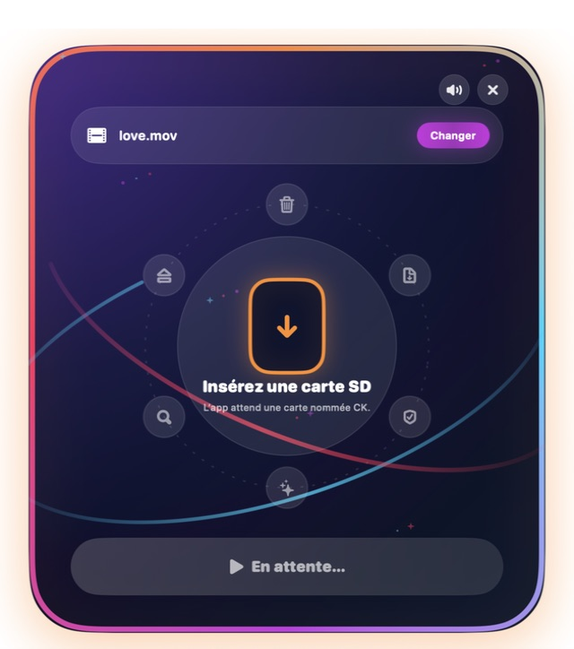

# Carte Claire — préparation de cartes SD

Carte Claire prépare les cartes SD utilisées par le projecteur : elle vide une
carte nommée `CK`, copie une seule vidéo, vérifie la copie octet par octet,
supprime les fichiers invisibles de macOS et éjecte la carte en toute sécurité.




## Versions prêtes à utiliser

- [Carte Claire 4.8 — application macOS](dist/Carte-Claire-v4.8.zip)
- [Outil ligne de commande — VERSION 8](dist/Outil-carte-SD-v8.0.zip)

L’application est recommandée pour l’équipe. Sa fenêtre arrondie reprend les
orbites lumineuses et les étincelles de son icône, reste ouverte entre deux
cartes et détecte automatiquement la prochaine carte `CK`.

## Fonctionnement

1. Placez `love.mov` dans le dossier Téléchargements, ou choisissez une autre
   vidéo avec le bouton **Changer**.
2. Insérez une carte SD nommée `CK`.
3. Cliquez sur **GO !**. Le nettoyage commence directement.
4. Attendez le message de réussite et l’éjection automatique.
5. Retirez la carte et insérez la suivante ; l’application reste ouverte.

## Garanties de sécurité

- La carte n’est jamais reformatée.
- Seul le support externe monté exactement sous `/Volumes/CK` peut être traité.
- Le support est contrôlé comme externe avant tout effacement.
- La vidéo source ne peut pas se trouver sur la carte à vider.
- Une seule copie est réalisée et sa progression est surveillée.
- Carte Claire vérifie ses autorisations avant tout effacement.
- Aucun mot de passe administrateur n’est utilisé pendant la préparation.
- La copie est comparée intégralement avec l’original.
- Le résultat final doit contenir exactement la vidéo choisie.
- La corbeille générale du Mac n’est jamais touchée ; seule celle de la carte
  est supprimée.

Tout ce qui se trouve déjà sur la carte `CK` est définitivement supprimé dès le
clic sur **GO !**.

## Autorisations macOS

Placez d’abord Carte Claire dans le dossier **Applications**. Lors du premier
usage, macOS peut demander l’autorisation d’utiliser les volumes amovibles :
cliquez sur **Autoriser**.

Les dossiers Spotlight présents sur une carte sont protégés par macOS, même pour
un processus administrateur. Carte Claire 4.8 détecte cette situation avant tout
effacement et remplace toute l’interface par un guide d’autorisation. Son bouton ouvre directement
**Réglages Système > Confidentialité et sécurité > Accès complet au disque** :
activez **Carte Claire**, quittez l’app puis rouvrez-la. Cette opération n’est à
faire qu’une fois par Mac pour cette version de l’app.

Un diagnostic détaillé est conservé dans `~/Library/Logs/Carte Claire/`.

L’application fournie est signée localement, mais pas notariée avec un compte
Apple Developer. À la première ouverture sur un nouveau Mac, un clic droit sur
l’app puis **Ouvrir**, ou **Réglages Système > Confidentialité et sécurité >
Ouvrir quand même**, peut donc être nécessaire.

## Organisation du dépôt

- `CarteClaire/` : code source Swift de l’application macOS.
- `CommandLine/` : script autonome et mode d’emploi.
- `dist/` : archives immédiatement utilisables.
- `docs/` : captures et documentation visuelle.
- `scripts/build-app.sh` : reconstruction de l’application universelle.

## Reconstruire l’application

Un Mac équipé de Xcode est nécessaire. Depuis la racine du dépôt :

```bash
./scripts/build-app.sh
```

Le script crée `build-output/Carte Claire.app` et
`build-output/Carte-Claire.zip`. Le binaire produit est universel : Intel
(`x86_64`) et Apple Silicon (`arm64`), avec macOS 11 comme version minimale.
